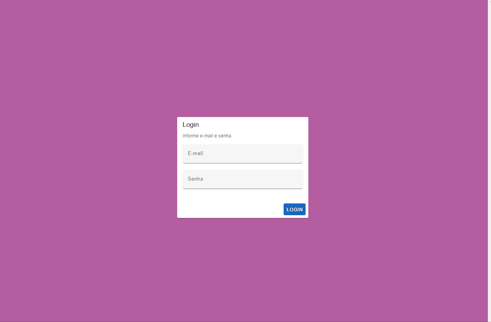

# Teste Time System

## Execução

Utilizando Docker Compose, basta acessar a pasta do repositório e executar `yarn dev`.

Todas as migrations e seeds serão executadas automaticamente.

Um usuário padrão será criado. E-mail e senha são `main@grr.la`.

Para executar os testes, execute `docker ps` para listar os containers levantados, pegue o container ID do `test-time-system-apache-php`.

Supondo que o container ID seja `e84c51035871`, execute `docker exec -it e84c51035871 sh`, você irá se conectar ao container já na pasta do Laravel, então apenas execute `php artisan test`.

## Containers

| Container  | URL                   |
| ---------- | --------------------- |
| Backend    | http://localhost      |
| Frontend   | http://localhost:3000 |
| PHPMyAdmin | http://localhost:3307 |
| Swagger    | http://localhost:8080 |

## Preview

Obrigado pela oportunidade 🤝
